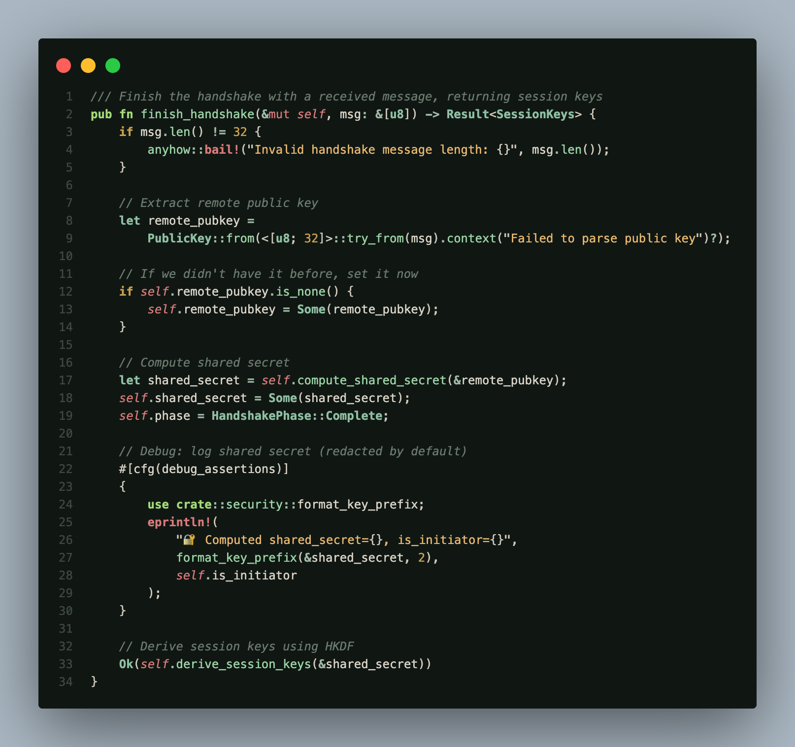
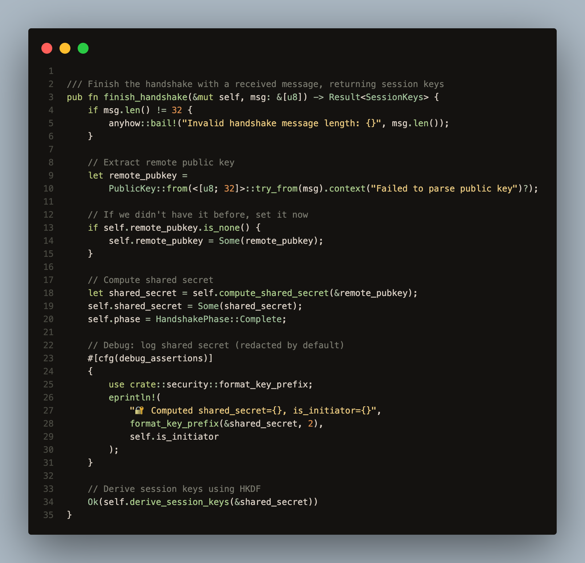
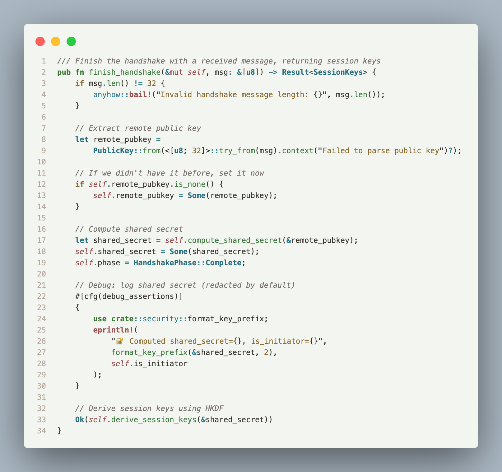
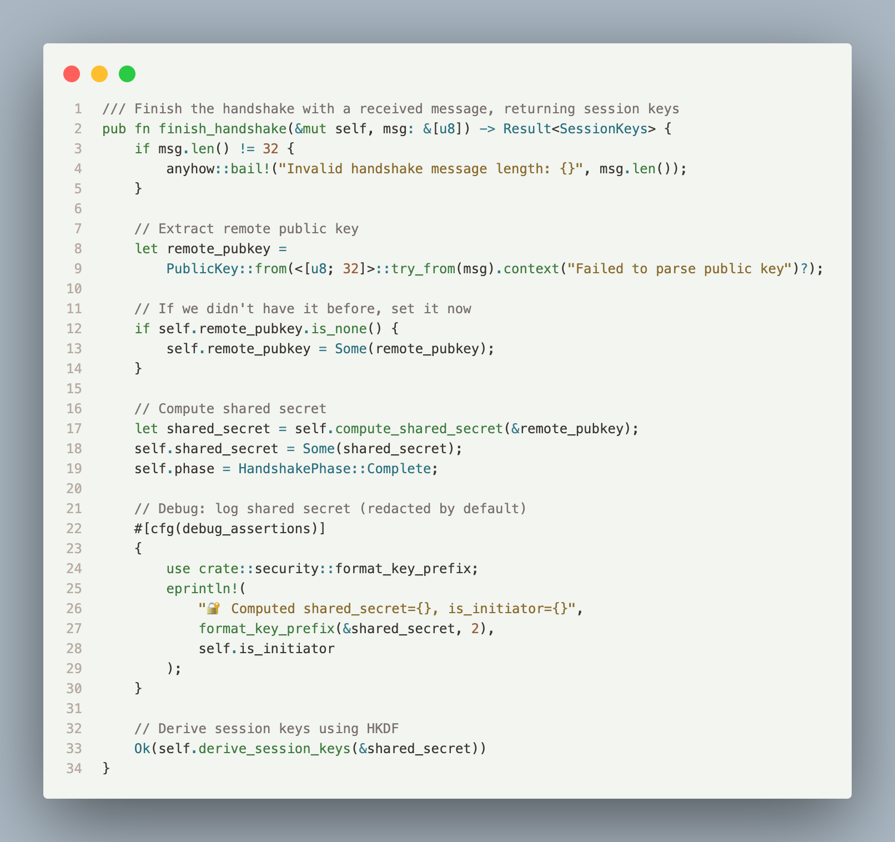

# Human Theme

Research-grade VS Code theme based on vision science and human perception. Designed with ecological color theory and scientifically validated for accessibility, eye comfort, and colorblind safety.

## Screenshots



## Features

### Accessibility & Vision Science
- **WCAG 2.1 Compliant** - All themes meet AA standards minimum, many AAA (7:1+ contrast ratios)
- **Colorblind Validated** - LMS cone simulation testing for protanopia, deuteranopia, and tritanopia
- **Perceptual Uniformity** - CIELAB color space for consistent perceived differences
- **Eye Comfort Optimized** - Green-dominant palette aligned with peak photopic sensitivity (555nm)

### Six Scientifically Designed Variants
- **Human Dark** - General coding with optimal contrast and eye comfort
- **Human Light** - Bright environments with maintained accessibility
- **Human Low Light** - Evening/night use with reduced blue light for circadian rhythm preservation
- **Human Soft** - Reduced contrast for extended viewing comfort (by design, prioritizes comfort over maximum accessibility)
- **Human Warm** - Warm color temperature with reduced blue light
- **Human High Contrast** - Maximum accessibility for low vision users

### Design Philosophy
- **Ecological Color Theory** - Natural color relationships inspired by Palmer & Schloss (2010)
- **Mercury OS Aesthetic** - Borderless, minimal UI with maximum content focus
- **Comprehensive Language Support** - 220+ TextMate scopes covering 30+ programming languages
- **Semantic Highlighting** - Full semantic token support for enhanced code understanding

### Color Modes






## Installation

**From Marketplace:**
1. Press `Ctrl+P` / `Cmd+P`
2. Type `ext install TomHall.human-theme`

**Automatic System Mode Switching:**
1. Open Settings (`Cmd+,` / `Ctrl+,`)
2. Set "Preferred Dark Color Theme" → "Human Dark"
3. Set "Preferred Light Color Theme" → "Human Light"
4. Enable "Window: Auto Detect Color Scheme"

**Manual:**
```bash
git clone https://github.com/tom-f-hall/human-theme-vscode.git
cd human-theme-vscode
npm install && npm run build
```

## Themes

All themes feature carefully balanced color palettes that meet rigorous scientific standards while maintaining visual appeal and usability.

| Theme | Type | Background | Primary Use | WCAG | Colorblind Safety |
|-------|------|------------|-------------|------|-------------------|
| **Human Dark** | Dark | `#101713` | General coding, default dark theme | ✓ AA/AAA | Good (2/3) |
| **Human Light** | Light | `#EDF3EB` | Bright environments, daytime coding | ✓ AA/AAA | ✓ Excellent (3/3) |
| **Human Low Light** | Dark | `#141210` | Evening/night, reduced blue light | ✓ AA/AAA | Good (2/3) |
| **Human Soft** | Light | `#F2F5F0` | Extended sessions, reduced eye strain | ✓ AA | Moderate (comfort-focused) |
| **Human Warm** | Light | `#F5F0E8` | Warm preference, reduced blue light | ✓ AA/AAA | Good (2/3) |
| **Human High Contrast** | Dark | `#000000` | Maximum accessibility, low vision | ✓ AAA | ✓ Excellent (3/3) |

### Theme Selection Guide

**For Maximum Accessibility:** Human High Contrast or Human Light  
**For Evening Coding:** Human Low Light (reduced blue light)  
**For All-Day Comfort:** Human Dark or Human Soft  
**For Warm Preference:** Human Warm  
**For System Auto-Switching:** Human Dark (dark mode) + Human Light (light mode)

## Color Palette

The theme uses an ecological color palette inspired by natural environments, optimized for human visual perception.

### Semantic Color Groups

**Greens (Keywords, Functions)** - 550nm wavelength (peak human photopic sensitivity)
- `#A3D977` Keyword Bold - Language keywords, control flow
- `#9AD1A3` Function Moss - Function names, method calls
- High eye comfort scores (75-84/100)

**Teals (Types, Structure)** - 490-520nm wavelength
- `#8FBFA3` Type Sage Bold - Type definitions, classes, interfaces
- `#9FB8A5` Operator Sage - Operators, structural elements
- Excellent eye comfort (80-88/100)

**Ochre (Literals, Constants)** - 580-590nm wavelength
- `#E8B86F` Warning Amber - String literals, warnings
- `#C9A24D` Warm Bold - Numeric literals, constants
- Warm, earthy tones for data

**Reds (Errors, Alerts)** - 620-640nm wavelength
- `#E84040` Error Clay - Error messages, critical alerts
- High visibility for important notifications

**Browns (HTML, Markup)** - Autumn leaf aesthetic
- `#C9A257` HTML Earthy - HTML/XML tags, structural markup
- `#B8956F` Attribute Muted - Element attributes
- Natural, grounded appearance for document structure

**Grays (Comments, UI)** - Neutral tones
- `#6B7A6F` Comment Muted - Comments, disabled elements
- Subtle enough to de-emphasize, clear enough to read

## Supported Languages

Human Theme provides comprehensive syntax highlighting for 30+ languages through 220+ TextMate scopes:

### Core Languages
JavaScript/TypeScript, Python, Java, C/C++, C#, Go, Rust, PHP, Ruby

### Web Development
HTML, CSS/SCSS/LESS, JSX/TSX, Vue, Angular, GraphQL, JSON, XML, SVG

### Systems & Scripts
Shell/Bash, PowerShell, Lua, Assembly

### Data & Config
YAML, TOML, INI, SQL, Protocol Buffers

### Specialized
Kotlin, Swift, Scala, Haskell, Elixir, Clojure, Dart, R, Julia, Objective-C, Fortran, COBOL, Terraform, LaTeX, VBA

### Markup & Documentation
Markdown (rich hierarchical styling), Git diffs, Docker

## Validation Results

All themes undergo rigorous scientific validation:

### WCAG 2.1 Contrast Ratios
- **Human Dark:** 6/6 colors pass (5 AAA, 1 AA)
- **Human Light:** 6/6 colors pass (all AA+)
- **Human Low Light:** 6/6 colors pass (5 AAA, 1 AA)
- **Human Soft:** 6/6 colors pass (all AA+) - reduced contrast by design
- **Human Warm:** 6/6 colors pass (all AA+)
- **Human High Contrast:** 6/6 colors pass (5 AAA, 1 AA)

### Colorblind Safety (LMS Cone Simulation)
- **Human Dark:** Good - Keywords ✓, Warnings ✓, Errors need care in protanopia
- **Human Light:** Excellent - All critical pairs pass all colorblind simulations
- **Human Low Light:** Good - Keywords ✓, Warnings ✓, Errors need care in protanopia
- **Human Soft:** Moderate - Prioritizes comfort over maximum colorblind distinction
- **Human Warm:** Good - Errors ✓, Warnings ✓, Keywords need care in protanopia
- **Human High Contrast:** Excellent - All critical pairs pass all simulations

### Eye Comfort Scores (0-100 scale)
- Green tones: 75-88 (Excellent)
- Teal tones: 79-88 (Excellent)
- Ochre tones: 52-58 (Good to Adequate)
- Red tones: 46-55 (Adequate, intentionally alerting)

## Development

### Add Theme Variant

Edit `src/themeConfig.ts`:
```typescript
{
  name: "Human Custom",
  type: "dark",
  base: { background: "#101713", foreground: "#E4E8E3" },
  green: { keywordBold: "#A3D977", functionMoss: "#9AD1A3" },
  // ... add remaining color groups
}
```

### Build & Validate
```bash
npm run build     # Generate themes
npm run validate  # Check compliance
```

## Architecture

The theme is built with a modular, scientifically-grounded architecture:

### Core Modules
- **`colorScience.ts`** - Vision science implementations
  - sRGB ↔ CIELAB ↔ XYZ color space conversions
  - WCAG 2.1 contrast ratio calculations
  - LMS cone simulation for colorblind testing (Brettel et al. 1997)
  - Perceptual uniformity metrics (ΔE*ab)
  - Eye comfort scoring based on photopic sensitivity

- **`themeConfig.ts`** - Theme variant definitions
  - Six theme palette configurations
  - Semantic color group organization
  - UI color specifications

- **`textMateRules.ts`** - Syntax highlighting rules
  - 220+ scope definitions
  - 30+ language support
  - Hierarchical token styling

- **`semanticTokens.ts`** - Semantic token colors
  - LSP-based intelligent highlighting
  - Context-aware color assignment

- **`uiColors.ts`** - Editor UI colors
  - Mercury OS-inspired minimal design
  - Borderless interface elements
  - Consistent focus indicators

- **`terminalColors.ts`** - ANSI terminal palette
  - 16-color terminal support
  - Consistent with theme aesthetics

- **`build.ts`** - Theme generator and validator
  - Automated theme generation
  - Scientific validation suite
  - WCAG compliance checking

### VS Code Configuration Support

The theme provides comprehensive VS Code customization through the `contributes` section:

**Theme Switching:**
- Automatic system dark/light mode detection
- Configurable preferred themes per mode
- Six theme variants for different use cases

**UI Customization:**
- Mercury OS borderless design
- Minimal, distraction-free interface
- Consistent color language throughout

**Semantic Highlighting:**
- Full semantic token support
- Enhanced code understanding through LSP
- Context-aware syntax coloring

**Terminal Integration:**
- Custom ANSI color palette
- Consistent with editor theme
- High contrast terminal output

## References

This theme is grounded in peer-reviewed research and international standards:

1. **CIE (1976)** - *CIELAB color space*  
   International Commission on Illumination standard for perceptually uniform color representation

2. **Palmer, S. E., & Schloss, K. B. (2010)** - *An ecological valence theory of human color preference*  
   Proceedings of the National Academy of Sciences, 107(19), 8877-8882  
   Foundation for ecological color selection

3. **Brettel, H., Viénot, F., & Mollon, J. D. (1997)** - *Computerized simulation of color appearance for dichromats*  
   Journal of the Optical Society of America A, 14(10), 2647-2655  
   LMS cone simulation methodology

4. **W3C (2018)** - *Web Content Accessibility Guidelines (WCAG) 2.1*  
   International standard for digital accessibility

5. **Fairchild, M. D. (2013)** - *Color Appearance Models* (3rd ed.)  
   Wiley. ISBN: 978-1-119-96703-3  
   Color science and perception theory

6. **Stockman, A., & Sharpe, L. T. (2000)** - *The spectral sensitivities of the middle- and long-wavelength-sensitive cones*  
   Vision Research, 40(13), 1711-1737  
   Photopic sensitivity and cone response functions

## Contributing

Contributions are welcome! This theme prioritizes:
- Scientific accuracy in color space conversions
- Evidence-based accessibility decisions
- Comprehensive language support
- Minimal, focused UI design

### Adding a New Language
1. Identify TextMate scopes for the language
2. Add scope rules to `src/textMateRules.ts`
3. Test with sample code
4. Run `npm run build`

### Adding a Theme Variant
1. Define palette in `src/themeConfig.ts`
2. Ensure WCAG compliance (minimum AA)
3. Run `npm run validate` to test
4. Update README with validation results

## License

MIT License - see LICENSE file for details.

---

**Human Theme** - Bringing vision science to your code editor.  
Created with attention to accessibility, eye comfort, and evidence-based design.
